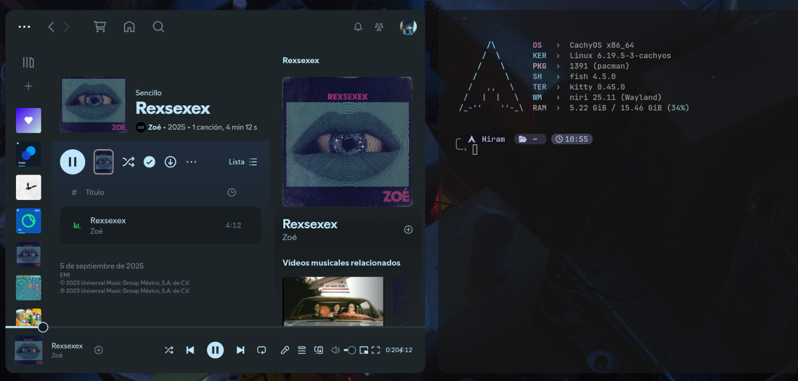

# 📝 Dotfiles

Personal Linux configuration built around a **minimal Wayland workflow**.

Focused on simplicity, speed and a clean terminal experience.

---

## 🖼️ Preview

<p align="center">
  
</p>

---

## 🖥️ Environment

| Component          | Setup   |
| ------------------ | ------- |
| **Distro**         | CachyOS |
| **Display Server** | Wayland |
| **Compositor**     | Niri    |

---

## ⚙️ Core Tools

| Tool          | Description                   |
| ------------- | ----------------------------- |
| **Niri**      | Scrollable Wayland compositor |
| **Fish**      | Friendly interactive shell    |
| **Starship**  | Fast and minimal prompt       |
| **Fastfetch** | System information display     |
| **Claude 4.6**| AI assistant (Claude Code CLI)|

---

## 📁 Structure

```
.
├── fastfetch
│   └── config.jsonc
├── fish
│   ├── conf.d
│   └── config.fish
├── niri
│   └── config.kdl
├── starship.toml
└── desktop.png
```

---

## 🎯 Philosophy

* Fast
* Minimal
* Terminal-centric
