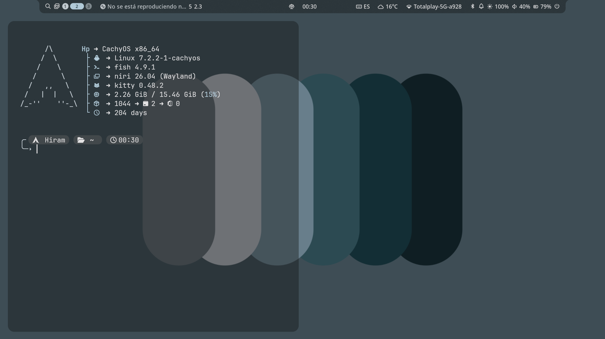

# 📝 Dotfiles

Focused on simplicity, speed and a clean terminal experience with dynamic colors.

---

## 🖼️ Preview

<p align="center">
  
</p>

---

## 🖥️ Environment

| Component          | Setup          |
| ------------------ | -------------- |
| **Distro**         | CachyOS        |
| **Display Server** | Wayland        |
| **Compositor**     | Niri           |
| **Shell**          | Serpantinum    |

---

## ⚙️ Core Tools

| Tool          | Description                              |
| ------------- | ---------------------------------------- |
| **Serpantinum**| Niri Wayland shell (quickshell)          |
| **Kitty**     | GPU-accelerated terminal                 |
| **Fish**      | Friendly interactive shell               |
| **Starship**  | Fast and minimal prompt                  |
| **Fastfetch** | System information display               |
| **matugen**   | Material You color generator (dynamic)   |
| **eza**       | Modern `ls` replacement                  |

---

## 🎨 Dynamic Colors

Colors are generated dynamically from the wallpaper via **matugen**. Changing the wallpaper automatically updates:

- **Kitty** terminal colors (`colors.conf`)
- **Fastfetch** module colors (`config.jsonc`)
- **Starship** prompt palette (`starship.toml`)

---

## 📁 Structure

```
.
├── fastfetch
│   └── config.jsonc.template    # matugen template
├── fish
│   ├── conf.d/
│   │   ├── 00_env.fish          # env, PATH, LS_COLORS
│   │   ├── 10_functions.fish    # bang-bang, history, copy
│   │   ├── 20_bindings.fish     # key bindings
│   │   └── 30_aliases.fish      # eza, git, system aliases
│   └── config.fish              # main fish config
├── kitty
│   └── kitty.conf               # includes dynamic colors.conf
├── niri/
│   ├── config.kdl               # niri main config
│   └── config/
│       ├── input.kdl
│       ├── layout.kdl
│       ├── keybinds.kdl
│       └── ...
├── starship
│   └── starship.toml.template   # matugen template
└── desktop.png
```

---

## 🎯 Philosophy

* Fast
* Minimal
* Terminal-centric
* Dynamic colors
